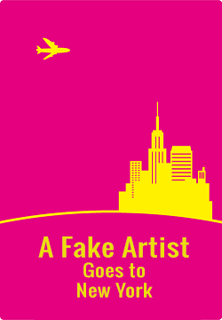

# A Fake Artist Goes to New York

This player aid for A Fake Artist Goes to New York eliminates the need for a Question master and lets everyone participate.

This code powers https://fake-artist.herokuapp.com - where you can play the game.

It is based on [Evan Brumley's](https://github.com/evanbrumley) Spyfall game.

The original boardgame at BoardGameGeek: https://boardgamegeek.com/boardgame/135779/fake-artist-goes-new-york

# Running Your Copy
Feel free to contact me if you want help running your own instance. I have more detailed explnation of how to deploy the app in the works.

Requirements:
MeteorJS
NodeJS

To start the application, simply run 'meteor' from the directory in which you cloned the repository. You will then be able to access the application from localhost:3000.

# Translation
The translation has two parts: the user interface and the words list.
The words lists are in the \lib\ directory. to add a new wordlist you should add it in main.js in the getRandomWordAndCategory();
The UI translations are in the \i18n\ directory. To add a new UI translation simply copy the English (en.i18n.json), rename the file prefix with the language code you want to translate
and change the translated strings on the right side.

# Credits
I can code but can't draw, so all the art of the game come from the artists of [The Noun Project](https://thenounproject.com/)
Art by Will Deskins from the Noun Project
Fake Mustache by Claire Jones from the Noun Project
Salvador Dali by Simon Child from the Noun Project
